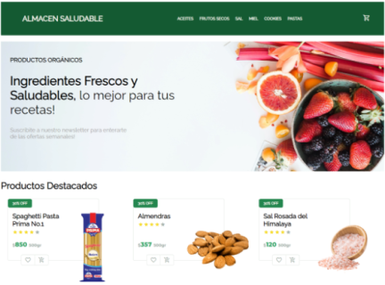

# Almacen Saludable: E-commerce React Coderhouse 37080

## Librerías utilizadas:

- ### `react-router-dom`
- ### `firebase`

## Levantar el proyecto localmente

### `git clone https://github.com/samielee86/almacen-saludable.git`

### `npm install`

### `npm start`
